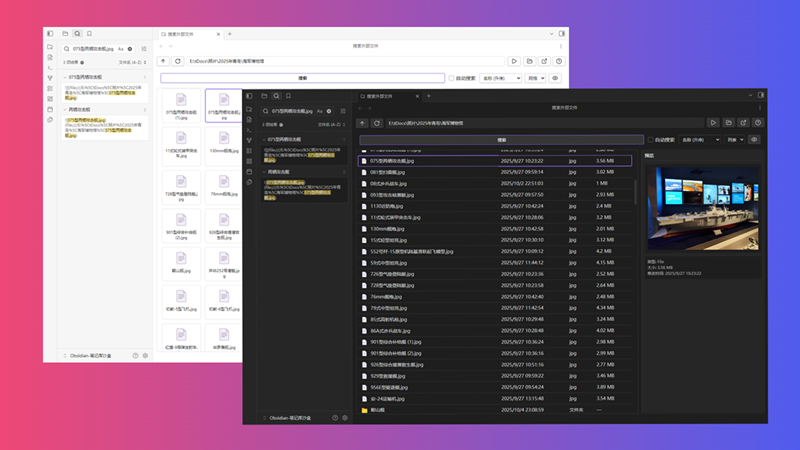
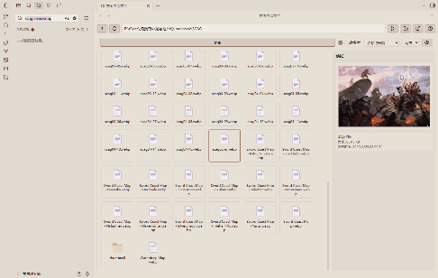

# Search External Files for Obsidian

Browse external files and search for file or folder paths in Obsidian.

> A large number of files are stored on the PC, and they usually have their own categories. A common example is photos. During an outdoor activity, we may take a large number of photos, which are too numerous to fit in Obsidian's vault. Too many files will only interfere with the search.
>
> External links are a great solution, but when you want to move or delete a file without knowing if it is being used in Vault, manually opening Obsidian for search is too cumbersome.
>
> This plugin adds an external file browser to Obsidian. Select a file, click the button (or automatically) to search for the file in Obsidian, and quickly display the search results for the external file.

## Features

This plugin allows you to browse the local file system within Obsidian and quickly search for selected files or folder paths.

This plugin is read-only and will never modify any files in your vault! All runtime data is temporary and will not affect your notes.

## Usage

1. Open the plugin: Click the folder-search icon in the left ribbon, or use the command.
2. File navigation: Use the top navigation buttons (Up, Refresh) and the path bar to jump to directories.
3. Select items: Click on a file or folder to select it. After selection, you can open the preview sidebar (click the "Preview" button) to view image preview and information.
4. Search:
    - Double-click a file (or select it and click the "Search" button) to search for its filename.
    - select a folder and click the "Search" button to search for its path.
5. Auto search: Check "Auto Search" to automatically trigger a search whenever you click on a file or folder.

## Notes

I am not a professional programmer, and this plugin relies on AI assistance during production, which may have unknown issues.
